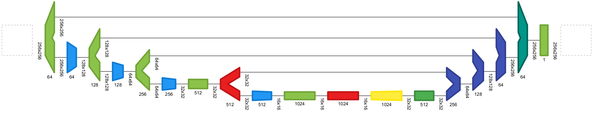
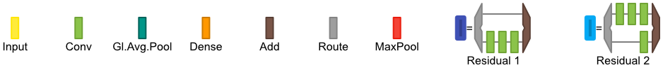

# Net2Vis

:white_check_mark: Automatic Network Visualization

:white_check_mark: Levels of Abstraction

:white_check_mark: Unified Design

Created by <a href="https://a13x.io/" target="_blank">Alex Bäuerle</a>, <a href="https://www.uni-ulm.de/in/mi/institut/mitarbeiter/c-onzenoodt/" target="_blank">Christian van Onzenoodt</a> and <a href="https://www.uni-ulm.de/in/mi/institut/mi-mitarbeiter/tr/" target="_blank">Timo Ropinski</a>.

Accessible <a href="http://viscom.net2vis.uni-ulm.de" target="_blank">online</a>.

## What is this?
Net2Vis automatically generates abstract visualizations for convolutional neural networks from Keras code.

## How does this help me?
When looking at publications that use neural networks for their techniques, it is still apparent how they differ.
Most of them are handcrafted and thus lack a unified visual grammar.
Handcrafting such visualizations also creates abiguities and misinterpretations.

With Net2Vis, these problems are gone.
It is designed to provide an abstract network visualization while still providing general information about individual layers.
We reflect the number of features as well as the spatial resolution of the tensor in our glyph design.
Layer-Types can be identified through colors.
Since these networks can get fairly complex, we added the possibility to group layers and thus compact the network through replacing common layer sequences.

The best of it: Once the application runs, you just have to paste your Keras code into your browser and the visualization is automatically generated based on that.
You still can tweak your visualizations and create abstractions before downloading them as SVG and PDF.

## How can I use this?

Either, go to our <a href="http://viscom.net2vis.uni-ulm.de" target="_blank">Website</a>, or install Net2Vis locally.
Our website includes no setup, but might be slower and limited in network size depending on what you are working on.
Installing this locally allows you to modify the functionality and might be better performing than the online version.

## Installation
Starting with Net2Vis is pretty easy (assuming python3, and npm).
1. Clone this Repo
2. For the Backend to work, we need Cairo and Docker installed on your machine. This is used for PDF conversion and running models pasted into the browser (more) secure.

For docker, the docker daemon needs to run.
This way, we can run the pasted code within separate containers.

For starting up the backend, the following steps are needed:
1. Go into the backend folder: `cd backend`
2. Install backend dependencies by running `pip3 install -r requirements.txt`
3. Install the docker container by running `docker build --force-rm -t tf_plus_keras .`
3. Install cario binding for python for your distribution (e.g. `python-cairosvg` on Debian).
4. To start the server, issue: `python3 server.py`

The frontend is a react application that can be started as follows:
1. Go into the frontend folder: `cd net2vis`
2. Install the javascript dependencies using: `npm install`
3. Start the frontend application with: `npm start`

## Citation
If you find this code useful please consider citing us:

    @article{bauerle2019net2vis,
      title={Net2Vis: Transforming Deep Convolutional Networks into Publication-Ready Visualizations},
      author={B{\"a}uerle, Alex and Ropinski, Timo},
      journal={arXiv preprint arXiv:1902.04394},
      year={2019}
    }

## Acknowlegements

This work was funded by the Carl-Zeiss-Scholarship for Ph.D. students.
